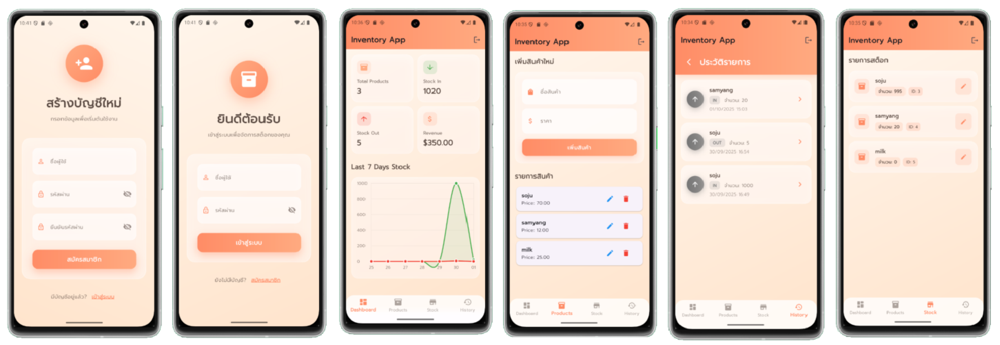

<div align="center">

# 📦 Inventory My App

### ระบบจัดการสต็อกสินค้า

[](https://flutter.dev)
[](https://dart.dev)
[](LICENSE)

**แอปพลิเคชันจัดการคลังสินค้าแบบครบวงจร รองรับทุกแพลตฟอร์ม**

[🚀 เริ่มต้นใช้งาน](#-การติดตั้งและใช้งาน) • [📖 เอกสาร](#-โครงสร้างโปรเจกต์) • [👥 ทีมพัฒนา](#-ทีมผู้พัฒนา) • [🤝 สนับสนุน](#-การสนับสนุนโปรเจกต์)

---



</div>

---

## 📋 สารบัญ

- [เกี่ยวกับโปรเจกต์](#-เกี่ยวกับโปรเจกต์)
- [ฟีเจอร์หลัก](#-ฟีเจอร์หลัก)
- [เทคโนโลยีที่ใช้](#-เทคโนโลยีที่ใช้)
- [โครงสร้างโปรเจกต์](#-โครงสร้างโปรเจกต์)
- [การติดตั้งและใช้งาน](#-การติดตั้งและใช้งาน)
- [การใช้งาน API](#-การใช้งาน-api)
- [สถาปัตยกรรมแอป](#-สถาปัตยกรรมแอป)
- [ตัวอย่างหน้าจอ](#-ตัวอย่างหน้าจอในการใช้งาน)
- [ทีมผู้พัฒนา](#-ทีมผู้พัฒนา)
- [การสนับสนุนโปรเจกต์](#-การสนับสนุนโปรเจกต์)
- [License](#-license)

---

## 🎯 เกี่ยวกับโปรเจกต์

**Inventory My App** คือระบบจัดการสต็อกสินค้าที่พัฒนาด้วย **Flutter Framework** เพื่อให้ธุรกิจสามารถบริหารจัดการคลังสินค้าได้อย่างมีประสิทธิภาพ รองรับการใช้งานบนทุกแพลตฟอร์ม (Android, iOS, Web) ด้วย Codebase เดียว

### 🎨 ไฮไลท์

- 🎯 **ใช้งานง่าย** - UI/UX ออกแบบให้ใช้งานสะดวก เรียนรู้ได้เร็ว
- 🚀 **ประสิทธิภาพสูง** - ตอบสนองเร็ว รองรับข้อมูลจำนวนมาก
- 📱 **Multi-Platform** - ใช้งานได้ทั้ง Mobile (Android/iOS) และ Web
- 🎨 **Modern Design** - ดีไซน์ทันสมัย ด้วยธีมสีส้มที่สวยงาม
- 🔐 **ปลอดภัย** - ระบบยืนยันตัวตนที่แข็งแกร่ง

---

## ✨ ฟีเจอร์หลัก

### 🔐 ระบบจัดการผู้ใช้
- 📝 สมัครสมาชิกใหม่
- 🔑 เข้าสู่ระบบที่ปลอดภัย
- 👤 จัดการโปรไฟล์ผู้ใช้

### 📊 Dashboard & Analytics
- 📈 แดชบอร์ดแสดงข้อมูลภาพรวมแบบ Real-time
- 📉 กราฟและชาร์ตวิเคราะห์ข้อมูล
- 🎯 สถิติสินค้าคงคลังและมูลค่า
- ⚡ การแจ้งเตือนสินค้าใกล้หมด

### 📦 จัดการสินค้า
- ➕ เพิ่ม/แก้ไข/ลบสินค้า
- 🔍 ค้นหาและกรองสินค้า
- 📷 อัพโหลดรูปภาพสินค้า
- 🏷️ จัดหมวดหมู่สินค้า

### 📥 จัดการสต็อก
- ✅ บันทึกการนำเข้าสินค้า
- ⬇️ บันทึกการเบิกสินค้า
- 🔄 ปรับปรุงสต็อกแบบ Real-time
- 📋 ตรวจสอบสต็อกคงเหลือ

### 📜 ประวัติการทำรายการ
- 🕐 บันทึกประวัติทุกธุรกรรม
- 🔎 ค้นหาและกรองประวัติ
- 📄 ส่งออกรายงาน
- 📊 วิเคราะห์การเคลื่อนไหวสินค้า

### 🎨 UI/UX Features
- 📱 Responsive Design - รองรับทุกขนาดหน้าจอ
- 🌙 สวยงามด้วย Google Fonts
- 🎭 Smooth Animations
- 🎯 Intuitive Navigation

---

## 🛠️ เทคโนโลยีที่ใช้

### Frontend Framework
-  **Flutter 3.0+** - UI Framework
-  **Dart 3.0+** - Programming Language

### State Management
- 🔄 **Provider** - จัดการ State แบบ Reactive

### UI Components & Styling
- 🎨 **Google Fonts** - Typography สวยงาม
- 📊 **Charts & Graphs** - แสดงข้อมูลเชิงสถิติ
- 🎭 **Custom Widgets** - UI Components ที่ออกแบบเอง

### Network & API
- 🌐 **HTTP Package** - การเชื่อมต่อ REST API
- 🔌 **API Services** - จัดการการเรียก Backend

### Development Tools
- 🔧 **Analysis Options** - มาตรฐานโค้ด
- 🐛 **Flutter DevTools** - Debugging และ Profiling

---

## 🗂️ โครงสร้างโปรเจกต์

```plaintext
inventory_my_app/
│
├── 📱 android/                    # โปรเจกต์ Android Native
│   ├── app/
│   │   ├── build.gradle.kts
│   │   └── src/
│   │       ├── main/             # AndroidManifest, Resources
│   │       ├── debug/
│   │       └── profile/
│   ├── build.gradle.kts
│   ├── gradle.properties
│   └── settings.gradle.kts
│
├── 🍎 ios/                        # โปรเจกต์ iOS Native
│   ├── Flutter/
│   ├── Runner/
│   │   ├── AppDelegate.swift
│   │   ├── Info.plist
│   │   └── Assets.xcassets/
│   ├── Runner.xcodeproj/
│   └── Runner.xcworkspace/
│
├── 🌐 web/                        # ไฟล์สำหรับ Web Platform
│   ├── favicon.png
│   ├── icons/
│   ├── index.html
│   └── manifest.json
│
├── 💻 lib/                        # โค้ดหลักของแอป (Flutter/Dart)
│   ├── 🚀 main.dart              # Entry Point ของแอป
│   │
│   ├── 🌐 api/                   # API Service Layer
│   │   ├── api_service.dart      # Base API Service
│   │   ├── auth_service.dart     # Authentication API
│   │   ├── dashboard_service.dart # Dashboard Data API
│   │   ├── product_service.dart  # Product Management API
│   │   └── stock_service.dart    # Stock Management API
│   │
│   ├── 📦 models/                # Data Models (DTO)
│   │   ├── dashboard.dart        # Dashboard Data Model
│   │   ├── product.dart          # Product Model
│   │   ├── stock_transaction.dart # Transaction Model
│   │   └── user.dart             # User Model
│   │
│   ├── 🔄 providers/             # State Management
│   │   └── auth_provider.dart    # Authentication State
│   │
│   ├── 📱 screens/               # UI Screens
│   │   ├── dashboard_screen.dart     # หน้าแดชบอร์ด
│   │   ├── login_screen.dart         # หน้าเข้าสู่ระบบ
│   │   ├── register_screen.dart      # หน้าสมัครสมาชิก
│   │   ├── product_screen.dart       # หน้าจัดการสินค้า
│   │   ├── stock_list_screen.dart    # หน้ารายการสต็อก
│   │   └── transaction_history_screen.dart # หน้าประวัติ
│   │
│   ├── 🛠️ utils/                 # Utility Functions
│   │   └── helpers.dart          # Helper Functions
│   │
│   └── 🧩 widgets/               # Reusable Widgets
│       ├── chart_widget.dart     # Chart Components
│       ├── product_item.dart     # Product Card Widget
│       └── stock_item.dart       # Stock Item Widget
│
├── 🎨 assets/                     # Asset Files
│   └── images/
│       └── Inventory.png
│
├── 📄 pubspec.yaml               # Dependencies & Assets Config
├── 🔍 analysis_options.yaml      # Linter Rules
└── 📖 README.md                  # เอกสารโปรเจกต์

```

### 📚 คำอธิบายโฟลเดอร์สำคัญ

| โฟลเดอร์ | คำอธิบาย |
|---------|---------|
| **`android/`** | โปรเจกต์ Android Native (Gradle, Kotlin/Java) |
| **`ios/`** | โปรเจกต์ iOS Native (Xcode, Swift/Objective-C) |
| **`web/`** | ไฟล์สำหรับ Web Platform (HTML, Manifest) |
| **`lib/`** | โค้ด Dart ทั้งหมด (ส่วนหลักของแอป) |
| **`lib/api/`** | Service Layer สำหรับเรียก API |
| **`lib/models/`** | Data Models และ Entity Classes |
| **`lib/providers/`** | State Management ด้วย Provider Pattern |
| **`lib/screens/`** | หน้าจอ UI ต่างๆ ของแอป |
| **`lib/widgets/`** | Custom Widgets ที่ใช้ซ้ำได้ |
| **`lib/utils/`** | Utility และ Helper Functions |
| **`assets/`** | รูปภาพ, ฟอนต์, และไฟล์ Asset อื่นๆ |

---

## 🚀 การติดตั้งและใช้งาน

### ✅ ข้อกำหนดเบื้องต้น

ก่อนเริ่มต้น โปรดตรวจสอบว่าคุณได้ติดตั้งเครื่องมือดังต่อไปนี้แล้ว:

- ✔️ **Flutter SDK** (v3.0 หรือสูงกว่า) - [ดาวน์โหลด](https://flutter.dev/docs/get-started/install)
- ✔️ **Dart SDK** (v3.0 หรือสูงกว่า) - มาพร้อม Flutter
- ✔️ **Android Studio** หรือ **VS Code** - IDE สำหรับพัฒนา
- ✔️ **Android SDK** - สำหรับ build Android app
- ✔️ **Xcode** - สำหรับ build iOS app (เฉพาะ macOS)
- ✔️ **Git** - Version control

### 📥 ขั้นตอนการติดตั้ง

#### 1️⃣ Clone โปรเจกต์

```bash
git clone https://github.com/your-username/inventory_my_app.git
cd inventory_my_app
```

#### 2️⃣ ติดตั้ง Dependencies

```bash
flutter pub get
```

#### 3️⃣ ตรวจสอบ Flutter Environment

```bash
flutter doctor
```

#### 4️⃣ รันแอปพลิเคชัน

**สำหรับ Android:**
```bash
flutter run -d android
```

**สำหรับ iOS:**
```bash
flutter run -d ios
```

**สำหรับ Web:**
```bash
flutter run -d chrome
```

**หรือเลือก Device แบบ Interactive:**
```bash
flutter run
```

### 🔧 การ Build แอป

#### Build Android APK
```bash
flutter build apk --release
```

#### Build Android App Bundle
```bash
flutter build appbundle --release
```

#### Build iOS App
```bash
flutter build ios --release
```

#### Build Web App
```bash
flutter build web --release
```

---

## 🌐 การใช้งาน API

### ⚙️ การตั้งค่า API Endpoint

แก้ไขไฟล์ `lib/api/api_service.dart`:

```dart
class ApiService {
  static const String baseUrl = 'https://inventory-ctvh.vercel.app/api';
  
  // กำหนด endpoints
  static const String loginEndpoint = '$baseUrl/auth/login';
  static const String registerEndpoint = '$baseUrl/auth/register';
  static const String productsEndpoint = '$baseUrl/products';
  static const String stocksEndpoint = '$baseUrl/stocks';
}
```

### 📡 API Endpoints

| Method | Endpoint | Description |
|--------|----------|-------------|
| `POST` | `/auth/login` | เข้าสู่ระบบ |
| `POST` | `/auth/register` | สมัครสมาชิก |
| `GET` | `/dashboard` | ข้อมูล Dashboard |
| `GET` | `/products` | รายการสินค้าทั้งหมด |
| `POST` | `/products` | เพิ่มสินค้าใหม่ |
| `PUT` | `/products/:id` | แก้ไขสินค้า |
| `DELETE` | `/products/:id` | ลบสินค้า |
| `GET` | `/stocks` | รายการสต็อก |
| `POST` | `/stocks` | บันทึกธุรกรรมสต็อก |
| `GET` | `/transactions` | ประวัติการทำรายการ |

---

## 🏗️ สถาปัตยกรรมแอป

### 🎯 Design Pattern

แอปนี้ใช้ **Provider Pattern** สำหรับ State Management ร่วมกับ **Repository Pattern** สำหรับการจัดการข้อมูล

```
┌─────────────┐
│   UI Layer  │  (Screens & Widgets)
└──────┬──────┘
       │
┌──────▼──────┐
│   Provider  │  (State Management)
└──────┬──────┘
       │
┌──────▼──────┐
│  Repository │  (Data Layer)
└──────┬──────┘
       │
┌──────▼──────┐
│ API Service │  (Network Layer)
└─────────────┘
```

### 📊 Data Flow

1. **UI** → เรียก method จาก **Provider**
2. **Provider** → เรียก **Repository** เพื่อดึงข้อมูล
3. **Repository** → เรียก **API Service**
4. **API Service** → ติดต่อ Backend
5. **Response** → ส่งกลับผ่าน **Repository** → **Provider** → **UI**

---

## 📸 ตัวอย่างหน้าจอในการใช้งาน

<div align="center">

### 🖥️ หน้าจอหลักของแอปพลิเคชัน


---

### 📱 ฟีเจอร์ต่างๆ

| Dashboard | Product Management | Stock Control |
|:---------:|:------------------:|:-------------:|
| 📊 ภาพรวมข้อมูล | 📦 จัดการสินค้า | 📥 จัดการสต็อก |

</div>

> 💡 **หมายเหตุ:** Screenshots แสดงการทำงานจริงของแอปพลิเคชัน

---

## 👥 ทีมผู้พัฒนา

**ทีมผู้พัฒนา:**

- 👨‍💻 นายสิทธิชัย แสงนนท์ 6612732134
- 👨‍💻 นายพีรพัฒน์ สุทธปัญญา 6612732121
- �‍💻 นางสาววาสินี มาฤทธิ์ 6712732126
- 👩‍💻 นางสาววรัญญา ฉิมงาม 6712732125

---

**สาขาวิชาวิทยาการคอมพิวเตอร์**  
คณะวิทยาศาสตร์และเทคโนโลยี  
🎓 **มหาวิทยาลัยราชภัฏศรีสะเกษ**

---

### 🏛️ สถาบันการศึกษา

**สาขาวิชาวิทยาการคอมพิวเตอร์**  
คณะวิทยาศาสตร์และเทคโนโลยี  
🎓 **มหาวิทยาลัยราชภัฏศรีสะเกษ**

[](https://www.ssru.ac.th)

</div>

---

⭐ **ถ้าโปรเจกต์นี้มีประโยชน์ อย่าลืม Star ให้ด้วยนะครับ!** ⭐

</div>